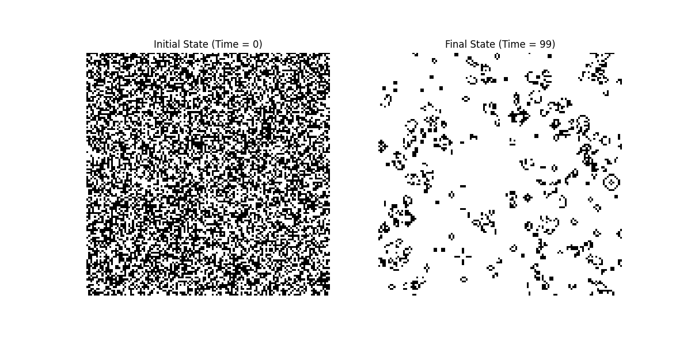
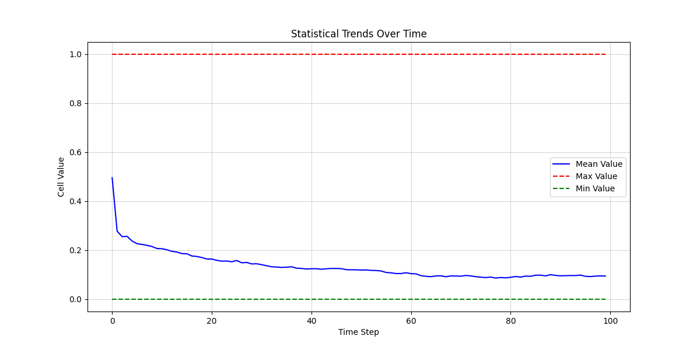
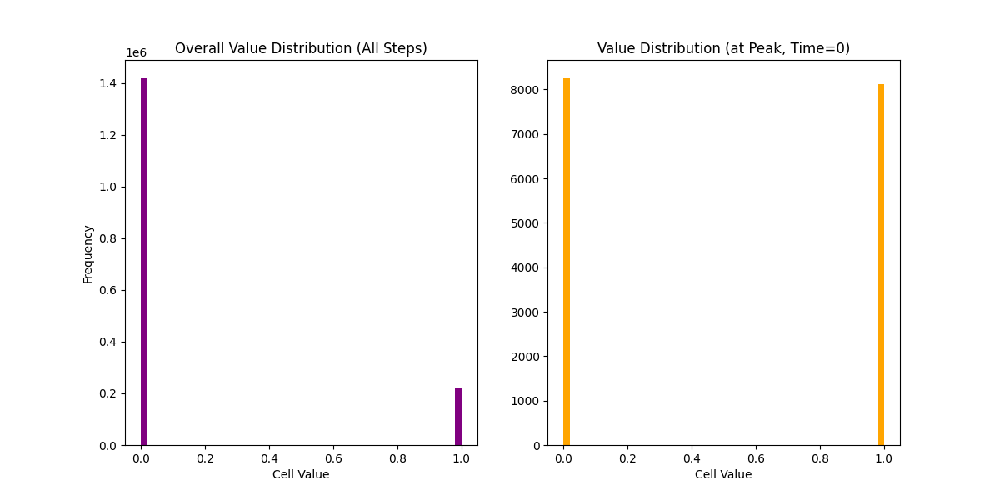

# Automata Studio: Simulation Report

**Source File:** `gol_sim.nc`
**Generated on:** 2025-08-17 15:32:36

## Summary Statistics
- **Dimensions:** ('time', 'y', 'x')
- **Shape:** (100, 128, 128)
- **Overall Mean Value:** 0.1345
- **Overall Std Dev:** 0.3412

## State Snapshots

A look at the initial and final configurations of the grid.

## Time Series Analysis

This chart shows the evolution of the grid's mean, maximum, and minimum cell values over time.

## Distribution Analysis

These histograms show the frequency of cell values, both for the entire simulation and for the single time step with the highest total cell value sum.

